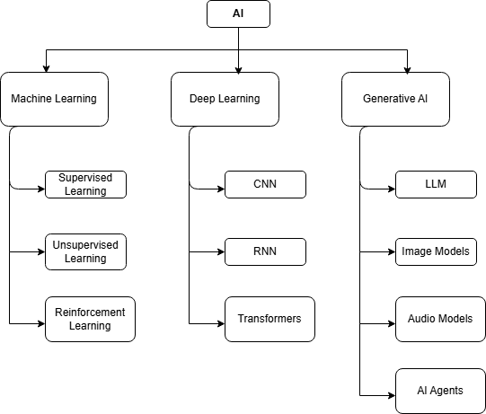

# Week 1 - Day 1

## Topics Covered

- Artificial Intelligence
- Machine Learning
- Deep Learning
- Generative AI
- Large Language Models

## Artifacts

- Notes.md
- AI-Diagrams.md
- Assignment.md
- AI-Ecosystem.drawio

## Diagram

## Learning Outcome

Understood the relationship between AI, Machine Learning, Deep Learning and Generative AI.